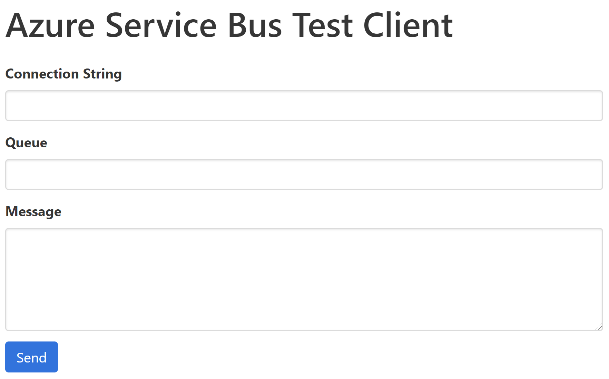

# Azure Service Bus Test Client
A test client for sending messages to Azure Service Bus

# Prerequisites
Node v10+

# Running the client
- Clone the repo and run `npm install` to install required npm packages
- Update the preferred port in the `config.js` file.  By default this is set to **3011**.
- Run `node index` to start the application.

The application can be run in a container if preferred by running the `scripts/start` script.

# Using the client
The below screenshot shows an overview of the the client.

## Set the connection string
This can be found in the Azure portal under Shared Access Policies for either the root account or a specific queue key.

This must be in the below format and note that the validation provided by the client is case sensitive.  For example "endpoint=..." would be invalid.  EntityPath is optional as it only applies to queue policies.

`Endpoint=sb://YOUR_HOSTNAME/;SharedAccessKeyName=KEYNAME;SharedAccessKey=KEY;EntityPath=QUEUE`

## Set the queue name
This is the queue where the message will be sent to.

## Message
This is the message that will be sent to the specified queue and must be in JSON format.

# Errors
If invalid crendentials or malformed JSON is provided an error will be returned through the client.
